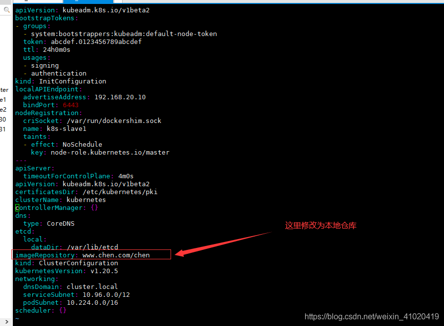

#Kubernetes私有化

两部分

1.kubernetes本身插件，kuberctl，kubeadm，网络插件等

2.容器镜像源，docker的镜像源

都可以手动配置


## 第一部分

1.对yum，apt-get等修改kubernetes下载源

2.kubeadm init 在执行时会向k8s的仓库拉取

## 查看kubeadm config所需的镜像

```cpp
$ kubeadm config images list

k8s.gcr.io/kube-apiserver:v1.13.1
k8s.gcr.io/kube-controller-manager:v1.13.1
k8s.gcr.io/kube-scheduler:v1.13.1
k8s.gcr.io/kube-proxy:v1.13.1
k8s.gcr.io/pause:3.1
k8s.gcr.io/etcd:3.2.24
k8s.gcr.io/coredns:1.2.6
```

## #第一种：中转

从私有云拉取镜像，然后修改镜像的tag

```sh
sudo docker tag registry.cn-beijing.aliyuncs.com/imcto/kube-controller-manager:v1.13.1 k8s.gcr.io/kube-controller-manager:v1.13.1
sudo docker tag registry.cn-beijing.aliyuncs.com/imcto/kube-apiserver:v1.13.1 k8s.gcr.io/kube-apiserver:v1.13.1
sudo docker tag registry.cn-beijing.aliyuncs.com/imcto/kube-proxy:v1.13.1 k8s.gcr.io/kube-proxy:v1.13.1
sudo docker tag registry.cn-beijing.aliyuncs.com/imcto/kube-scheduler:v1.13.1 k8s.gcr.io/kube-scheduler:v1.13.1
sudo docker tag registry.cn-beijing.aliyuncs.com/imcto/etcd:3.2.24 k8s.gcr.io/etcd:3.2.24
sudo docker tag registry.cn-beijing.aliyuncs.com/imcto/pause:3.1 k8s.gcr.io/pause:3.1
sudo docker tag registry.cn-beijing.aliyuncs.com/imcto/coredns:1.2.6 k8s.gcr.io/coredns:1.2.6	


images=(  # 下面的镜像应该去除"k8s.gcr.io/"的前缀，版本换成上面获取到的版本
	kube-apiserver:v1.20.5
	kube-controller-manager:v1.20.5
	kube-scheduler:v1.20.5
	kube-proxy:v1.20.5
	pause:3.2
	etcd:3.4.13-0
	coredns:1.7.0
)

for imageName in ${images[@]} ; do  #循环上述的镜像
   #从国内pull镜像
    docker pull registry.cn-hangzhou.aliyuncs.com/google_containers/$imageName
    #将镜像修改相应的tag
    docker tag registry.cn-hangzhou.aliyuncs.com/google_containers/$imageName www.chen.com/chen/$imageName
    #push到私有仓库
    docker push www.chen.com/chen/$imageName
    docker rmi registry.cn-hangzhou.aliyuncs.com/google_containers/$imageName
done


```



## #第二种：修改配置

使用kubeadm配置文件，通过在配置文件中指定docker仓库地址，便于内网快速部署。

生成配置文件

```swift
kubeadm config print init-defaults ClusterConfiguration >kubeadm.conf
```

```bash
vi kubeadm.conf
# 修改 imageRepository: k8s.gcr.io
# 改为 registry.cn-beijing.aliyuncs.com/imcto
imageRepository: registry.cn-beijing.aliyuncs.com/imcto
# 修改kubernetes版本kubernetesVersion: v1.13.0
# 改为kubernetesVersion: v1.13.1
kubernetesVersion: v1.13.1
```

```sh
$ kubeadm config images list --config kubeadm.conf
registry.cn-beijing.aliyuncs.com/imcto/kube-apiserver:v1.13.1
registry.cn-beijing.aliyuncs.com/imcto/kube-controller-manager:v1.13.1
registry.cn-beijing.aliyuncs.com/imcto/kube-scheduler:v1.13.1
registry.cn-beijing.aliyuncs.com/imcto/kube-proxy:v1.13.1
registry.cn-beijing.aliyuncs.com/imcto/pause:3.1
registry.cn-beijing.aliyuncs.com/imcto/etcd:3.2.24
registry.cn-beijing.aliyuncs.com/imcto/coredns:1.2.6
```

拉取镜像并初始化

```css
kubeadm config images pull --config kubeadm.conf
kubeadm init --config kubeadm.conf
```

```
3个网址，在应用yaml文件创建资源时，将文件中镜像地址进行内容替换即可
k8s.gcr.io 
quay.io
gcr.io 


1、初始化master节点

kubeadm init \

#设置api的主机，这里是master节点

--apiserver-advertise-address=192.168.235.10 \

#设置下载镜像的源，这里是阿里的源

--image-repository registry.aliyuncs.com/google_containers \

#设置下载的kubernetes版本

--kubernetes-version v1.18.20 \

#设置集群内部使用的地址段，不要访问外网

--service-cidr=10.96.0.0/12 \

#设置容器使用的地址段，不要与其他网络地址冲突

--pod-network-cidr=10.244.0.0/16

#每个大版本的最终版本可以直接访问如下链接进行查询

https://mirrors.aliyun.com/kubernetes/yum/repos/kubernetes-el7-x86_64/Packages/
```

## 第二部分

```
如果在 Docker 官方仓库拉取的镜像是私有仓库
拉取方法类似如下：
$ docker pull xxx/yyy:zz
#使用中科大镜像源，应该类似这样拉取：

$ docker pull docker.mirrors.ustc.edu.cn/xxx/yyy:zz
```

